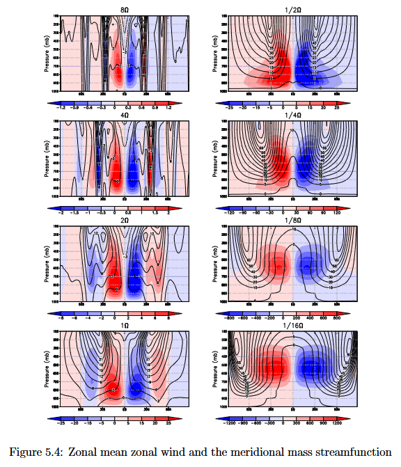

# why
Questions

## 왜 대기 대순환 세포는 3개인가?

### [Atmospheric Circulation of Exoplanets (2009, Showman et al.)](https://arxiv.org/pdf/0911.3170)

#### [reddit comment (2017, u/agate_)](https://www.reddit.com/r/explainlikeimfive/comments/7lmjun/comment/drovjao/)

Original comment

(...)

A related concept, which gives quantitative answers about the number of circulation cells a planet will have, is the "Rhines scale". Turbulent storms on planets tend to merge and become larger and more organized over time, but that same "ice skater effect" limits their ability to grow in the north-south direction. Thus they grow wider as they coalesce to form a pattern of east-west jets and circulation cells. The limiting size is roughly given by the equation

L = sqrt(U R T)

where U is the velocity of winds on the planet, R is its radius, and T is the time for a full rotation (1 day). (Experts note, I've simplified and ignored some constants here, but their value is about 1.)

For the Earth (U = 30 m/s, R = 6300 km, T = 86400 s), the Rhines scale is about 4000 km, or about 30 degrees of latitude, so there's room for about 6 circulation cells from equator to pole. On Venus (U = 100 m/s, R = 6000 km, T = 20 million s), the scale is 100,000 km, bigger than the planet, so there's only one circulation cell. For Jupiter, the planet is big enough to contain about 20 of its Rhines scales, and it has about 20 circulation cells. This scale works great to predict the number of circulation cells on Mars, the other gas giants, and Titan too.

$$
\begin{aligned}
L&: \text{Rhines Scale} \\
 &: \text{circulation size limit} \\
 &= \sqrt{U \cdot R \cdot T} \\
U&: \text{wind speed} \\
R&: \text{planet radius} \\
T&: \text{1 day}
\end{aligned}
$$

##### On Earth

$$
\begin{aligned}
U &= 30\ \text{m/s} \\
R &= 6300\ \text{km} \\
T &= 86400\ \text{s} \\
L &\approx 4041\ \text{km} \\
  &\approx {37\degree \over 180\degree} \pi T
\end{aligned}
$$

### [Comparative Planetary Circulation Regimes with a Simplified GCM (2012, Wang)](https://web.archive.org/web/https://www2.physics.ox.ac.uk/sites/default/files/2012-03-08/1_wang_pdf_19025.pdf)

## 부동산 거래는 언제 생겨났을까? 

- 집은 언제, 어디에 생겨나는가?
- 사람들은 언제 이사를 하는가?
- 집은 어떻게 거래되었는가?

## BPM Detection 알고리즘?

## 수렵채집인은 어떻게 생활했을까?

- Levy Walk
- Dunbar's Number

## 강은 어떻게 국경이 되는가?

## DNA에서 적격한 문장의 집합은 얼마나 빽빽한가?

##